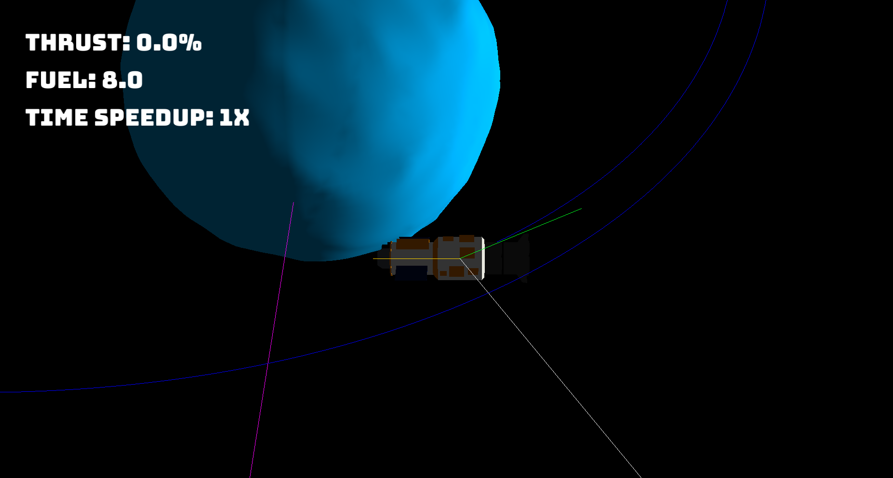

# Orbital Physics
## 15-466 Final Project

---
## Authors: 
| Responsibility | Member |
| --- | --- |
| Project Manager | Gustavo Silvera |
| Architect | Henry Du |
| Design/Art Lead | Thomas Carey |

---
# Design: 
    (TODO: In two sentences or fewer, describe what is new and interesting about your game.)

# Text Drawing: 
    (TODO: how does the text drawing in this game work? Is text precomputed? Rendered at runtime? What files or utilities are involved?)

# Choices: 
    (TODO: how does the game store choices and narrative? How are they authored? Anything nifty you want to point out?)

# Screen Shot:

# How To Play:

    (TODO: describe the controls and (if needed) goals/strategy.)

# Sources: 
    (TODO: list a source URL for any assets you did not create yourself. Make sure you have a license for the asset.)
- Font file: `BungeeSpice-Regular.ttf` (https://fonts.google.com/specimen/Bungee+Spice)

This game was built with [NEST](NEST.md).

