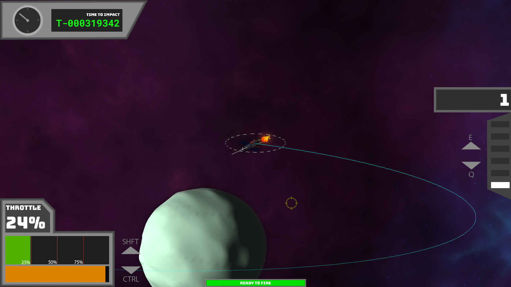

# Orbital Physics
## 15-466 Final Project

---
## Authors:
| Responsibility | Member |
| --- | --- |
| Project Manager | Gustavo Silvera |
| Architect | Henry Du |
| Design/Art Lead | Thomas Carey |

---
# Design:
Project Athena is a space game operating with realistic orbital mechanics. It offers the realism displayed by games like Kerbal Space Program and Universe Sandbox while not overloading the player with the complexities and high learning curve of such games. You as the player will gain an intuitive understanding of orbital mechanics as you try to traverse the solar system in order to reach your target, an asteroid on an impact collision, in order to redirect it with an ultra-high-power laser.

# Screen Shot:

# How To Play:

The goal of the game is to use your laser to move the asteroid until it is no longer on a collision course. Currently, there are three levels of increasing difficulty and an in-game tutorial covering the basic controls. A more in-depth tutorial is laid out below:

### Camera Controls:
- Rotate by dragging with any mouse button
- Zoom in/out using the scroll wheel
- While hovering your cursor over an object, press `TAB` to switch focus to that object. Pressing `~` will reset focus to the player.

### Universe Controls:
- Uses `Q` to increase time acceleration and `E` to decrease time acceleration. Note that player throttle and rotation controls will reset time acceleration to real-time (and similarly increasing time acceleration zeros your throttle).
- When the player or asteroid is near a sphere of influence (SOI) transition between two orbits, time acceleration will automatically be decreased.
- The time remaining until the asteroid collision event is displayed at the top left corner.
- Quicksave with `F5` or `2` and quickload with `F9` or `3`.
- Reload game params with `R`, also feel free to edit them in `params.ini`

### Player Controls:
- Increase your rocket engine throttle with `SHFT` (or `W`) and decrease with `CTRL` (or `S`). The UI contains a display of your current throttle and the fuel remaining in the lower left corner.
- Rotate your ship using `A` and `D`
- Fire your high powered laser with `SPACEBAR`. Aim with the mouse, which will automatically snap to the center of object. The UI contains a bar at the bottom center indicating if (or how-long-until) the laser is ready to fire.
- You'll want to shoot the beige fuel pellets to gain fuel and avoid the red debris pellets, change their frequency in `params.ini`

### General Tips:
- Note that the engine provides acceleration, which changes your velocity. Since space is very large it may seem like you're not moving when viewing at real-time. Try increasing time acceleration!
- The Athena laser is ultra-high-power, delivering a whopping 100 kN of force at close range. However, the laser's strength falls off by the inverse square law (just like in real life) and has a very long cooldown. Try to get as close to the target as possible before firing. If you miss, you can always time accelerate while waiting for the cooldown. The laser can be fired at any time acceleration level!
- Orbital mechanics can be confusing at the start. Unlike a more grounded environment, you don't simply fire your rocket toward where you want to go. Oversimplified:
    - Burning (a.k.a fire your rocket) along your current velocity (the line tangent to the orbit) will inflate the part of the orbit on the opposite side of your location. This is known as burning 'prograde'.
    - Burn against your current velocity will deflate the part of the orbit on the opposite side of your location. This is known as burning 'retrograde'.
    - Burn perpendicular to your current velocity to inflate the orbit on one side (i.e. left) while deflating the other side (i.e. right). This is known as burning 'radial-in' and burning 'radial-out'.
    - Note that the position you are at can highly impact how much fuel it takes to change your orbit by a certain amount! For example, it's much easier to raise the highest point of your orbit by burning prograde at the lowest point in your orbit than it is at the highest point of your orbit.
- Astrodynamics often presents excellent examples of the Butterfly Effect. A tiny change in velocity can result in massive changes in future orbit trajectories or very little at all. Even after our simplifications, there is still a sizeable learning curve and will not be easy for everyone. Quicksaving often can speed up the learning process!

# Sources:
The following is a list of free assets obtained online that all have free-to-use licenses.
- UI Font file: `BungeeSpice-Regular.ttf` (https://fonts.google.com/specimen/Bungee+Spice)
- Timer Font file: `RobotoMono-Bold.ttf` (https://fonts.google.com/specimen/Roboto+Mono)
- Laser SFX: `laser.wav` (https://freesound.org/people/Daleonfire/sounds/376694/)
- Rocket engine SFX: `engine.wav` (https://freesound.org/people/Zovex/sounds/237974/, converted to WAV format)
- Background music: `bgm.wav` (https://freepd.com/music/The%20Story.mp3, converted to WAV format)
This game was built with [NEST](NEST.md).

